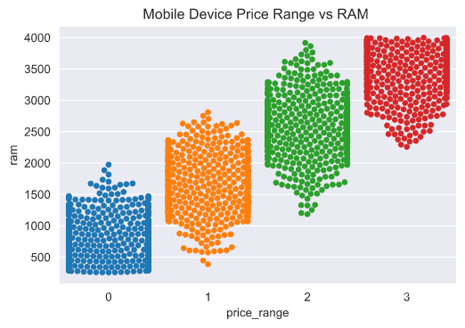

# Mobile Price Classification

Mobile Price Classificaation using [this](https://www.kaggle.com/iabhishekofficial/mobile-price-classification?select=train.csv) dataset from Kaggle.com

*Jupyter Notebook using pandas, numpy, seaborn, sklearn, and tensorflow.*

This is a classification problem in which we try to predict the price range for mobile devices based on features such as a phone's battery power or camera quality. The training set contains 20 of these features whose descriptions can be found in the Jupyter Notebook itself or the [link](https://www.kaggle.com/iabhishekofficial/mobile-price-classification?select=train.csv) to the dataset. We use these features to build Machine Learning models to classify each device into one of four price ranges (0, 1, 2, or 3 -- with 3 being the most expensive price range)

## Visualizations
Here are some interesting visualizations from the notebook made using Seaborn.

#### Distributions of each numerical variable in the dataset:

#### Price Range vs. RAM

I thought that this was an especially interesting graph because we can clearly see a correlation between a phone's RAM and its price range.

## Model Building

I built three different Machine Learning models using the training data. Here is a table that shows how each model performed:

Model | Accuracy
------|----------
Logistic Regression | 61%
Random Forest Classifier | 88%
Neural Network | 95%

I used the Neural Network to create price range predictions on the test set.

## Feature Importance

I thought it would also be interesting to see which features were the most important in determining a mobile device's price range.

Here is a graph of each feature's permutation importance built using the Random Forest Classifier.

*Permutation feature importance is the decrease in a model score when a single feature value is randomly shuffled*

This graph shows us that in addition to a phone's RAM, its battery power and screen resolution can also be determining factors when it comes to the price range.